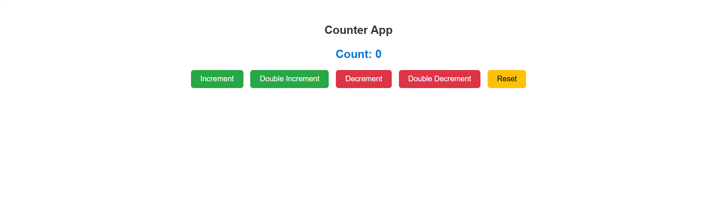

# React Counter App

A simple and interactive Counter App built using **React.js**. This project demonstrates the use of React Hooks (`useState`) for state management and showcases basic user interaction through increment, decrement, double increment, double decrement, and reset functionalities.

## 🚀 Features

- ✅ Increment and decrement counter
- ✅ Double increment and double decrement logic
- ✅ Reset counter to zero
- ✅ Prevents negative values
- ✅ Styled with custom CSS
- ✅ Clean and modular component structure

## 🖼️ UI Preview



## 📦 Technologies Used

- React.js
- JavaScript (ES6+)
- CSS
- Git & GitHub

## 📁 Folder Structure

CounterApp/
├── src/
│   ├── App.js
│   ├── CounterApp.js
│   ├── CounterApp.css
│   └── index.js
├── assets/
│   └── counter-app-preview.png
├── package.json
└── README.md
## 🛠️ Setup Instructions

1. Clone the repository:
   ```bash
   git clone https://github.com/your-username/counter-app.git
   cd counter-app
**Made with ❤️ by Sunny Vijay Shinde  
Full Stack Developer | React & .NET | Navi Mumbai, India**
   npm install
   npm start
   
